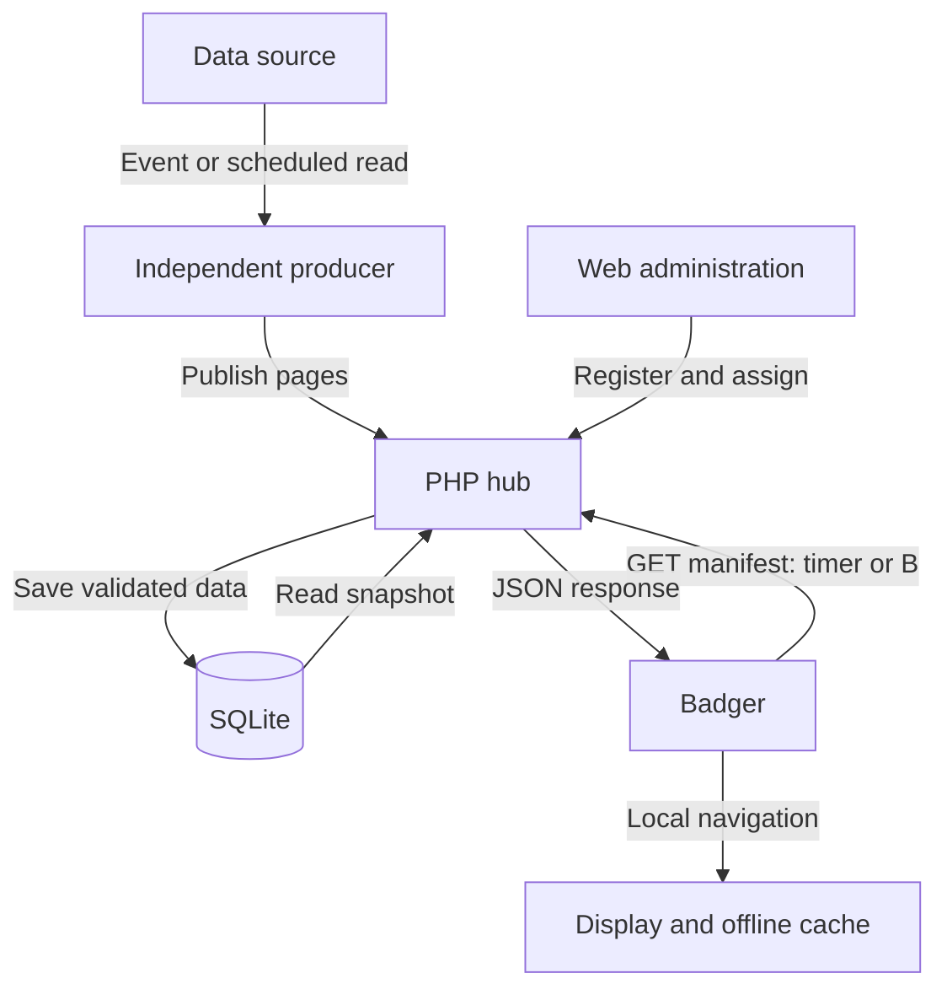

# Badger Hub

A universal, server-managed display application for **Pimoroni Badger 2040 W**.
Register apps in the web interface, assign them to devices, and publish changing
values through a scoped API. Adding a display app does not require new firmware.

- **Server:** PHP 8.2+ with PDO SQLite, preferably a maintained PHP 8.4+ installation.
- **Administration:** plain JavaScript and CSS; no build tools or runtime packages.
- **Device:** a small MicroPython client for Pimoroni's firmware. PHP and browser
  JavaScript cannot run as a normal application on the Badger firmware.
- **First version:** USB-powered continuous operation, text/value screens and
  read-only display apps. No remotely downloaded code or device control actions.

The German administration includes app/device registration, assignments,
activation, deletion, key rotation, a form-based page editor with live preview,
advanced JSON import/export and an audit trail.

## Installation and usage guides

**Step-by-step instructions (German):**

- **[Install the PHP server](docs/installation-server.md)** — requirements, HTTPS, Nginx/Apache, private storage, SFTP/FTPS hosting and maintenance.
- **[Set up the Badger 2040 W](docs/installation-badger.md)** — firmware, USB transfer, configuration, CA certificate, UTC clock and recovery.
- **[Use the hub and publish data](docs/usage.md)** — first app, device assignments, buttons, PHP publishing, intervals and key rotation.
- **[Understand the push/pull data flow](docs/data-flow.md)** — architecture and sequence diagrams, alternatives, latency and failure behavior.

**Recommended order: install the server → register a sample app and device → configure the Badger → add an independent data producer.**

- **[Bitaxe and Home Assistant setup](docs/home-assistant-bitaxe.md)** — ready-to-adapt HA package, local or shared hosting, scheduled updates and troubleshooting.

**No persistent PHP CLI process is needed. The PHP demo runs once; the included
Home Assistant automations run once per minute.**

## Status

Implemented and exercised with server, HTTP, device-model and transport tests.
**Not hardware-qualified:** real Badger flash/RAM use, certificate compatibility,
Wi-Fi recovery and watchdog behavior must pass the hardware checklist before an
unattended installation. Do not interpret the automated tests as certification
of the device or hosting configuration. See [verification](docs/verification.md).

## Architecture

1. An administrator registers an app and receives a publisher token once.
2. A trusted producer (PHP script, Node-RED, Home Assistant automation, etc.) pushes
   complete display pages to that app. It cannot modify other apps or devices.
3. The administrator registers a device and assigns up to ten apps.
4. The device downloads a bounded JSON manifest with only its assigned active apps.
5. All menu navigation works locally, including with no network.

The hub performs **no outbound HTTP requests**. An unavailable data source cannot
block device requests, and there is no arbitrary URL-fetch/SSRF surface. Producers
own their source-specific integration. A Home Assistant/Bitaxe YAML example is included; Fronius, weather and other
domain-specific integrations remain producer responsibilities.

### Push upstream, pull on the device

**The producer pushes pages to the hub; the Badger pulls a stored snapshot on its timer or with B. This keeps source collection outside device requests. App registration does not start a producer, and B does not trigger a fresh source measurement.**



**This hybrid design is retained for periodic read-only displays. It is not an event queue or immediate push delivery: intermediate updates can be skipped, and a successful publish does not acknowledge display on the device. See the [data-flow decision](docs/data-flow.md) for timing examples and alternatives.**

## Install the web service

Requirements: PHP >=8.2 with `pdo_sqlite`, `json`, `session` and standard password
hashing; SQLite >=3.24; a local writable data directory; HTTPS. Backups additionally
use SQLite's `VACUUM INTO` (>=3.27). Use local disk, **not NFS**, for SQLite and sessions.

1. Extract the project, e.g. into `/srv/badger-hub`.
2. Set the site's **document root to `/srv/badger-hub/public`**. Never serve the
   project root. `src`, `bin`, `device`, `var` and backups must not be web-accessible.
3. Run setup using the same operating-system account as PHP-FPM (or set ownership
   afterwards). Read the password without putting it in command history:

   ```bash
   cd /srv/badger-hub
   read -rsp 'New admin password: ' badger_password; echo
   printf '%s\n' "$badger_password" | php bin/setup.php https://badge.example.com
   unset badger_password
   ```

   Password: 16–72 bytes. Setup creates `var/config.json`, `var/hub.sqlite`, and
   `var/sessions`. Nothing is overwritten if configuration already exists.
4. Keep `var` private (directory 0700; files 0600) and owned by the PHP worker.
   Only that directory needs write access. Keep application code read-only to PHP.
5. Configure TLS and request limits. See [nginx example](docs/nginx.conf.example).
   Apache requires its document root to be `public/` too; `.htaccess` is provided
   for Authorization forwarding and directory-listing protection.
6. Open the HTTPS origin and sign in. Register an app, then a device and its apps.
   Save both keys when shown; only hashes are retained on the server.

An alternate config location can be supplied through `BADGER_CONFIG` in **both**
CLI and PHP-FPM environments. Its parent also holds the database and sessions.
If using FPM, explicitly pass that environment variable in the pool configuration.

For FTP hosting: upload all files outside the public directory, then point the
hosting document root at `public/`. If there is no CLI, setup can be run locally
with PHP and the generated `var` transferred securely, then edit the absolute `db`
path in `config.json` for the server. Remove the local secret copies afterwards.
A host that cannot isolate the private files is unsuitable for this layout.

### Required production hosting settings

- Serve one dedicated HTTPS origin. No subdirectory installation in this version.
- Ensure PHP receives `HTTPS=on` from the trusted TLS terminator. Arbitrary
  `X-Forwarded-Proto` and `X-Forwarded-For` client headers are intentionally ignored.
- Forward the `Authorization` header to PHP. Disable API caching, compression,
  transformation, chunking and CDN challenge pages. The client needs the original
  JSON and `Content-Length`; it sends HTTP/1.0 and `Accept-Encoding: identity`.
- Set PHP `display_errors=Off`, `log_errors=On`, `zlib.output_compression=Off`,
  `max_execution_time=10`, `memory_limit=128M`, and FPM
  `request_terminate_timeout=15s`. The FPM limit covers native calls as well.
- At the proxy/web server, bound request body/header read time, worker count and
  request rate. The app limits JSON bodies to 16 KiB. Apply edge limits especially
  to unauthenticated requests/session creation; application checks are not DDoS protection.
- Session locks wait at most 1 second; SQLite locks at most 2 seconds. An exhausted
  lock returns 503. There is no network I/O inside either lock.
- The login is rate-limited per direct source IP (10 attempts/15 min) and globally
  (100/15 min). Behind a reverse proxy the source IP may be shared; configure
  additional IP limits at the trusted edge, rather than trusting request headers.
- Run `php bin/maintenance.php cleanup` hourly as the PHP worker to remove expired
  sessions. Audit history is capped at 2,000 events; rate buckets expire.
- Back up and monitor available disk space, PHP errors, 401/429/503 rates and
  certificate expiry. Patch PHP, SQLite, the web server and device firmware.

### Local development only

```bash
read -rsp 'Test password: ' badger_password; echo
printf '%s\n' "$badger_password" | php bin/setup.php http://127.0.0.1:8080 --dev
unset badger_password
php -S 127.0.0.1:8080 -t public
```

The explicit development mode permits HTTP only from loopback. Never expose the
PHP development server, and never reuse a development config in production.

## Install the Badger client

1. Back up the existing Badger filesystem. Obtain Badger **2040 W** firmware from
   [Pimoroni](https://github.com/pimoroni/badger2040/releases). The `with-badger-os`
   image overwrites the filesystem; the plain image leaves existing files intact.
   This client replaces the startup `main.py`, not the Pimoroni firmware itself.
2. Copy `device/main.py`, `device/hub_core.py` and `device/hub_network.py` to the
   device root using Thonny or `mpremote`. Copy `config.example.py` as `config.py`.
3. Fill in Wi-Fi settings, server hostname, port, API path and **device** token.
   Do not use the publisher token on the device.
4. Obtain the server's issuing root CA from a trusted CA source or your managed
   PKI, verify it independently, and provision its DER certificate as `/ca.der`.
   Example conversion: `openssl x509 -in trusted-root.pem -outform DER -out ca.der`.
   One certificate, at most 8 KiB. Do not trust a certificate merely because an
   unauthenticated connection returned it. Rotate the trust anchor when needed.
5. Set the Pico RTC via USB/Thonny to **UTC**, then copy it to the external RTC:

   ```python
   import badger2040
   badger2040.pico_rtc_to_pcf()
   ```

   For `mpremote`, use its documented RTC-setting command and verify UTC. Keep the
   RTC powered; after complete loss of power, set the clock again before syncing.
6. Restart without holding C. The client downloads assigned apps and starts at
   the local menu. Use USB power for this version.

TLS always requires CA verification and the expected server hostname. Newer builds
use `SSLContext`; older builds use the documented verified `wrap_socket` API. A
firmware without the required verification API **fails closed**. No insecure TLS
fallback is included. If Pimoroni's supplied build cannot verify your certificate,
use a compatible build with Badger support before deployment. A standard Pico W
firmware alone does not include the Badger display module.

### Buttons and recovery

| Button | Menu | Inside an app |
|---|---|---|
| A | Open selected app | Next page |
| Up / Down | Previous / next app | Previous / next page |
| B | Refresh from server | Refresh from server |
| C | Stay in menu / cancel request | Return to menu / cancel request |

C cannot be remapped by an app. A held button generates one event until released.
An empty registry or deleted selected app returns safely to the menu.

- Each request has a 25-second overall deadline, checked between native operations.
- Socket operations have a 4-second timeout. C is checked between operations;
  it cannot interrupt native DNS/TLS code immediately.
- An 8-second hardware watchdog covers native calls that ignore timeouts. After a
  watchdog reset, automatic networking is disabled; press B to retry explicitly.
- After five ordinary consecutive failures, retries pause until B is pressed.
  Earlier retries use increasing delays. C cancellation also pauses automatic sync.
- Cache writes alternate two files, at most every ten minutes. One valid slot
  survives an interrupted replacement. Invalid/oversized manifests are rejected.
- Offline data is labelled `OFFLINE`; connected data older than its per-app TTL
  is labelled `OLD DATA`. Cache timestamps do not imply a successful current fetch.
- Hold **C while pressing reset** to leave the application before the watchdog
  starts. The USB REPL remains available for repairing files/settings. The E-Ink
  display may retain its previous image in this maintenance mode.

No software can guarantee recovery from every hardware fault. A blocked display
initialization, failing storage or power fault can still require physical reset.
Do not use this as the sole safety-critical alarm display.

This release intentionally does not call `sleep_for()` / `turn_off()`: once started,
the RP2040 watchdog cannot simply be disabled, and sleep has different behavior on
USB and battery. Adding battery mode requires hardware validation of that lifecycle.

## Publish changing data

Full protocol and status codes: [API documentation](docs/api.md).

`examples/publish.php` is a complete PHP CLI publisher using ext-curl. Set
`BADGER_URL` and `BADGER_APP_TOKEN` in the producer's secure environment and replace
its sample values with your data source. Invoke it from a scheduler or automation.
No credentials go in URLs. Do not run a producer on every device request.

Apps have 1–6 pages, each with 1–3 label/value rows. Version 1 deliberately uses
printable ASCII because the built-in bitmap font is not a Unicode renderer. Use
`Waerme`, `deg C` and `ug/m3`. The UI validates these limits server-side too.

## Maintenance

```bash
# Read the new password securely as in setup; supply it on stdin.
php bin/maintenance.php password
php bin/maintenance.php backup /private/backups/badger-2026-10-04.sqlite
php bin/maintenance.php cleanup
```

Password replacement invalidates existing admin sessions. Key rotation invalidates
old API keys. A timeout during a mutation has an **unknown outcome**: reload state
before retrying; issue a new key if a one-time token response was lost.

For restoration, stop PHP workers, preserve the current files, restore the
consistent SQLite backup and matching config with correct ownership, remove stale
`-wal`/`-shm` files only while workers are stopped, then restart. Never copy just the
active `.sqlite` file as a backup while WAL writes are in progress. Backups contain
sensitive display data and token hashes; protect and encrypt them appropriately.

Device caches are not encrypted. Revoking a token prevents future access but
cannot erase a disconnected display or cached filesystem. Clear both cache slots
and the token physically when retiring a device. Physical access can expose its
Wi-Fi password and device token.

## Tests

```bash
php tests/server.php
python3 -m unittest discover -s tests -v
node --check public/app.js
```

Python 3 is needed only for automated tests and the MicroPython device code, not
for the PHP web server. HTTP tests start an isolated server on loopback port 8080;
keep that port free. `PHP_BINARY` can select a PHP executable. The session-lock test
uses POSIX `fcntl` and is intended for Linux/macOS. See [verification](docs/verification.md)
for browser checks and the pending hardware acceptance procedure.

No Composer/npm runtime dependencies. Node is not needed on the production server.

## Design and sources

[Security model](docs/security.md) · [API](docs/api.md) · [Verification](docs/verification.md)

The implementation follows the documented Pimoroni drawing/buttons API and
MicroPython SSL/watchdog API; it is a separate project, not a modification of the
Pimoroni repository.

- [Pimoroni Badger reference](https://github.com/pimoroni/badger2040/blob/main/docs/reference.md)
- [Pimoroni launcher examples](https://github.com/pimoroni/badger2040/blob/main/badger_os/launcher.py)
- [MicroPython SSL](https://docs.micropython.org/en/latest/library/ssl.html)
- [MicroPython watchdog](https://docs.micropython.org/en/latest/library/machine.WDT.html)
- [PHP PDO SQLite](https://www.php.net/manual/en/ref.pdo-sqlite.php)
