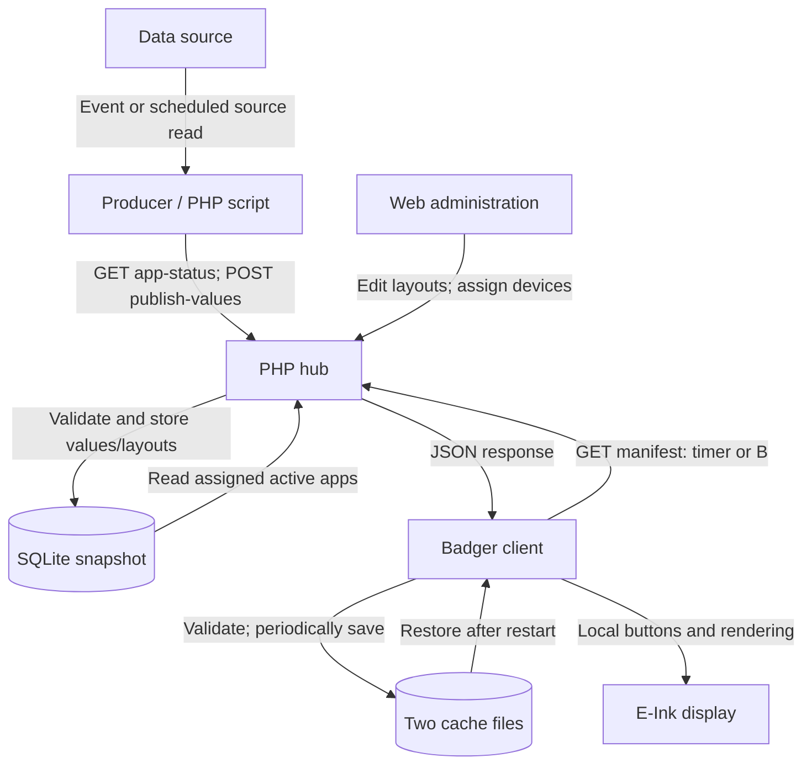

# Data flow: producer push, device pull

## Decision

Keep the current hybrid design for the USB-powered, read-only display application.
Producers publish independently to the hub; the Badger polls the hub's stored
snapshot. This decouples source availability from screen navigation and device
requests. No transport change is needed for the current use case.

An **app** is a registered set of display pages, not an executable application
that the hub downloads or runs. A **producer** is the script or automation which
obtains source values and publishes named data fields. The hub manages layouts. Registering an app alone does
not start a producer or schedule updates.

## Components and direction

Arrow labels distinguish an initiated request from data returned in a response.
All network connections shown are HTTPS. SQLite and device cache accesses are local.



The producer may run on the same server as the hub or on a separate machine with
access to the source, for example the home network. If a source offers only a read
API, the producer **pulls that source**, then **pushes the result to the hub**.
There is no requirement for the source itself to support webhooks.

The hub's web request handler never fetches an upstream source. It cannot hold a
device request open while waiting for Home Assistant, weather or a PV inverter.
The badge initiates its own connections; it does not expose an HTTP server or
require inbound port forwarding. Only the hub must be reachable from its clients.

## Successful update and failures

```mermaid
sequenceDiagram
    participant P as Producer
    participant H as PHP hub
    participant D as SQLite
    participant B as Badger
    P->>H: GET app-status with publisher token
    H-->>P: Current data_version and mode
    P->>H: POST publish-values with data version and values
    H->>D: Validate and conditionally update
    alt Version matches
        D-->>H: Commit new snapshot
        H-->>P: 200 and new version
    else Concurrent update
        H-->>P: 409; refresh state before retry
    end
    Note over P,B: Independent schedules; publishing does not contact the Badger
    B->>H: GET manifest with device token
    H->>D: Read assigned active apps
    D-->>H: Stored snapshots
    H-->>B: Bounded JSON manifest
    alt Response valid
        B->>B: Replace in-memory data; render locally
    else Network failure or invalid response
        B->>B: Keep previous data; bounded retries
    end
```

The manifest is a latest-state snapshot, **not a message queue**. If a producer
publishes three updates between device polls, the badge sees the most recent
stored update. It does not replay every intermediate event. Repeated publishing
replaces the data snapshot; it does not append a notification history.
Layout and data revisions are independent: an editor save preserves the newest
values, and a data publish preserves the layout. The hub formats rows when reading
the manifest; the device protocol does not change. Legacy whole-page publishing
remains available only for apps explicitly in `pages` mode.

## Why this choice fits

| Alternative | Consequence for this project | Decision |
|---|---|---|
| Producer push + badge polling | Simple PHP hosting, no inbound badge connection, source failures isolated | Current choice |
| Badge reads every source directly | Source credentials/parsers on each badge; more connections and firmware changes | Avoid for universal display apps |
| Hub reads sources during a badge request | Slow source delays every requesting badge; coupled failures and timeouts | Avoid |
| Independent scheduled collector on the server | Can read pull-only sources without delaying device requests | Compatible; implement as a producer |
| Server pushes directly to the badge | Requires a reachable listener or persistent connection; more recovery logic | Unnecessary for periodic display data |
| WebSocket, SSE or long polling | Persistent/long requests and reconnect handling; different PHP hosting demands | Not needed for current update latency |
| MQTT with retained state | Useful when a broker and event-driven clients already exist; adds broker lifecycle and device code | Possible future option, not implemented |

These are design tradeoffs for this implementation, not a claim that polling is
universally superior. For second-level alerts, interactive controls or delivery
of every event, revisit the protocol rather than presenting a snapshot API as an
event system. Commands would additionally need expiry, acknowledgements,
authorization and replay protection.

## Timing: three independent settings

| Setting | Owner | Effect |
|---|---|---|
| Producer interval | Cron / automation / producer | How often fresh source values reach the hub |
| `refresh_seconds` | Device settings in the hub | How often the badge fetches the hub; default 900 seconds |
| App `ttl` | App settings in the hub | When stored content is considered old; does not schedule a fetch |

Example: a producer samples and publishes every 60 seconds, a badge polls every
300 seconds, and the app TTL is 900 seconds. A change immediately after sampling
can take almost **60 + 300 = 360 seconds**, plus processing/network time, to appear
under successful periodic operation. This is an illustrative upper bound for
those schedules, not an outage guarantee. A source with its own update interval
adds that delay too.

B fetches the current hub snapshot immediately when its request succeeds. It does
**not** force the producer to collect a new measurement. Reducing the badge
interval cannot make an inactive producer deliver new data.

Choose intervals according to acceptable staleness, then size TTL above the normal
producer interval plus expected delay. For example, start with a producer interval
of 60 seconds, badge interval of 300 seconds and TTL of 900 seconds for a periodic
status display. These are example settings, not optimized battery values; the
current client stays powered on.

For bound apps, `updated_at` is **data receipt time** (zero before the first publish), not source measurement time. A producer
must not repeatedly send an unchanged *old measurement* and claim it is fresh.
On source failure, stop publishing a normal successful snapshot; allow TTL to
expire, or explicitly publish an error/status value. Include a measurement-time row
when its age matters. Layout edits do not reset data age. Static-only apps use
the last manual save time. A newly measured unchanged value may of course be published.

## Failure and recovery semantics

| Failure | Actual behavior |
|---|---|
| Producer/source stops | Hub still serves the last snapshot; TTL eventually marks it old |
| Hub/network unavailable | Badge keeps in-memory data; after restart it loads its last saved cache |
| Corrupt/oversized manifest | Rejected before replacing current data |
| Repeated ordinary failures | Increasing delays; automatic retries pause after five consecutive failures; B retries |
| Native networking call stalls | Watchdog can reset the device; next boot waits for explicit B before network access |
| C during a request | Cancellation at the next checkpoint; native calls are not instantly interruptible |
| App removed or disabled | Removed from the next successful manifest; offline badges retain their old snapshot |
| Device key revoked | Future API requests fail; stored display data cannot be remotely erased while offline |
| Publish response lost | Commit outcome unknown; query version and decide before retrying |

The device's flash cache is saved at most once per ten minutes, not after every
poll. A power loss can therefore restore an older snapshot than the last one seen
on screen. During normal operation, the newest valid manifest remains in RAM.
Cache contents and the retained E-Ink image are not encrypted.

A whole manifest fits below the 32 KiB limit (14,818 bytes in the existing maximum
configuration test). Deltas, per-app badge requests and ETags are not needed at
this scale. Reconsider them if payloads or device counts grow; also add scheduling
jitter before managing a large fleet that could poll simultaneously.

## References and related instructions

- [API contract](api.md): routes, tokens, schema and version checks.
- [Security model](security.md): locks, validation and infrastructure limits.
- [Server installation](installation-server.md), [Badger installation](installation-badger.md), [usage](usage.md) (German).
- [Pimoroni reference](https://github.com/pimoroni/badger2040/blob/main/docs/reference.md): device API and sleep behavior; battery sleep remains outside this release.
