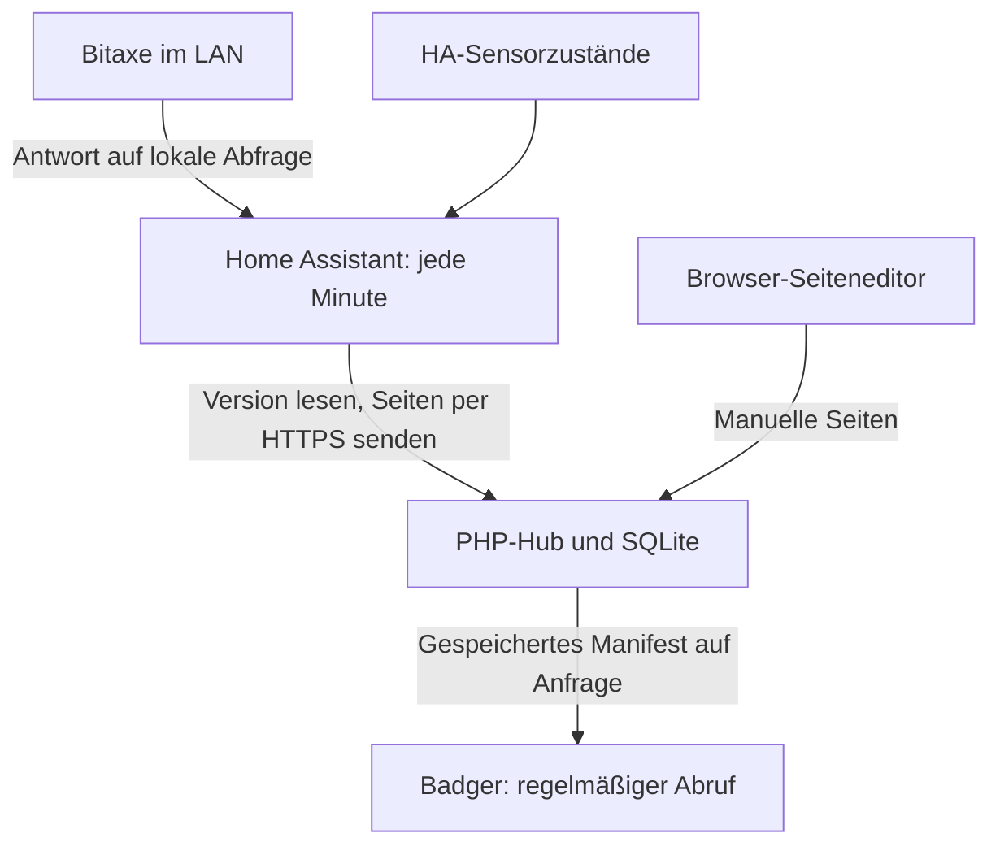

# Bitaxe und Home Assistant Schritt für Schritt

## Was läuft wann?

`examples/publish.php` läuft **genau einmal**, sendet feste Beispielwerte und beendet
sich. Es installiert keinen Zeitplan. Der PHP-Webservice arbeitet nur bei
HTTP-Anfragen; er benötigt keinen PHP-Daemon, Worker oder laufenden CLI-Prozess.
Setup und Wartung sind ebenfalls einzelne Aufrufe.

Die hier mitgelieferte Home-Assistant-Konfiguration startet **jede Minute** zwei
unabhängige, kurze Abläufe. Ein ausgeschalteter Home Assistant liefert keine Updates.
Der Hub und der Badger zeigen dann den letzten Stand; nach Ablauf der TTL ist er alt.

## 1. Standort des Hubs wählen

Du kannst den PHP-Hub auf einem NAS/Raspberry Pi/Server im eigenen Netz oder bei
einem Webhoster betreiben. Home Assistant muss den Hub erreichen; der Badger ebenso.
Bei lokalem Hosting ist keine Router-Portfreigabe notwendig. Eine eigene HTTPS-
Subdomain mit internem DNS und einem gültigen Zertifikat vereinfacht die Einrichtung.
Ein öffentlich vertrauenswürdiges Zertifikat lässt sich beispielsweise per DNS-
Challenge ausstellen, ohne den Hub öffentlich erreichbar zu machen.

**Auch intern bleibt HTTPS erforderlich.** Zertifikatsname, DNS und CA müssen
zusammenpassen. Die CA muss Home Assistant und dem Badger bekannt sein. Bei eigener
CA die Vertrauenskette korrekt installieren; `verify_ssl` nicht abschalten.
Der Hub ist eine separate PHP-Anwendung, kein mitgeliefertes HA-Add-on.

[Server installieren](installation-server.md): PHP + PDO SQLite, Domain auf `public`,
private Dateien außerhalb des Webverzeichnisses. Webspace ohne SSH kann einmalig
lokal vorbereitet und per SFTP übertragen werden. Für die Datenlieferung hier ist
weder PHP CLI auf Home Assistant noch ein Cronjob auf dem Webhoster erforderlich.



Home Assistant fragt Bitaxe ab. Der Hub greift weder auf Bitaxe noch auf HA zu.
Ein Quellenausfall blockiert daher keinen Geräteabruf. Bitaxe und HA müssen bei
externem Hosting nicht aus dem Internet erreichbar gemacht werden.

## 2. Zwei Apps registrieren

1. Im Hub **App registrieren**: ID `bitaxe`, Name `Bitaxe`, aktiv, TTL `300` Sekunden.
2. Im Seiteneditor Titel `Bitaxe`, eine Zeile `Status` / `Warte auf Daten` setzen.
3. Speichern und den einmalig angezeigten **Publisher-Schlüssel** sichern.
4. Zweite App: ID `home`, Name `Zuhause`, ebenfalls aktiv und TTL `300`.
5. Auch deren separaten Publisher-Schlüssel sichern.

Die Tokens bestimmen die Ziel-App; die App-ID wird nicht im Publish-Body übergeben.
Die beiden Tokens nicht vertauschen und keinen Geräteschlüssel dafür verwenden.

## 3. Badger zuweisen

Im Hub ein Gerät anlegen oder bearbeiten, **beide Apps anhaken**, Intervall auf
`60` Sekunden setzen und speichern. Den Geräteschlüssel gemäß
[Badgerinstallation](installation-badger.md) auf dem Badger eintragen, einschließlich
WLAN, HTTPS-Adresse, CA und gültiger Uhrzeit. USB-Dauerbetrieb verwenden.
Mit A eine App öffnen, mit C zurück; B liest sofort den gespeicherten Hub-Stand.
Mit Quellen- und Geräteintervall von jeweils 60 Sekunden kann eine Änderung knapp
zwei Minuten plus Verarbeitung benötigen. Ein längeres Geräteintervall spart Updates;
dann die TTL passend erhöhen, z. B. 900 Sekunden bei 300 Sekunden Geräteintervall.

## 4. Home-Assistant-Paket installieren

Die Beispiele verwenden die offizielle HA-Integration `rest_command` mit
`response_variable` und Pakete. Eine aktuelle Home-Assistant-Version verwenden.
Vor Änderungen die HA-Konfiguration sichern.

1. [home-assistant-package.yaml](../examples/home-assistant-package.yaml) nach
   `/config/packages/badger_hub.yaml` kopieren (Ordner nötigenfalls anlegen).
2. In `/config/configuration.yaml` Pakete aktivieren:

   ```yaml
   homeassistant:
     packages: !include_dir_named packages
   ```

   Einen vorhandenen `homeassistant:`-Block **ergänzen**, keinen zweiten anlegen.
   Bei bereits eingerichtetem Paketverzeichnis dessen vorhandene Struktur verwenden.
3. [home-assistant-secrets.example.yaml](../examples/home-assistant-secrets.example.yaml)
   in die vorhandene `/config/secrets.yaml` **einfügen**, diese nicht ersetzen.
4. In diesen fünf Einstellungen ersetzen:

   | Schlüssel | Dein Wert |
   |---|---|
   | `badger_status_url` | `https://DEIN-HUB/api.php?r=app-status` |
   | `badger_publish_url` | `https://DEIN-HUB/api.php?r=publish` |
   | `badger_bitaxe_url` | `http://DEINE-BITAXE-IP/api/system/info` |
   | `badger_bitaxe_authorization` | `Bearer ` gefolgt vom Bitaxe-Publisher-Schlüssel |
   | `badger_home_authorization` | `Bearer ` gefolgt vom Zuhause-Publisher-Schlüssel |

   Die Anführungszeichen beibehalten. Keine Schlüssel in URLs schreiben. `secrets.yaml`
   und HA-Sicherungen vertraulich halten; HA-Traces können Messdaten enthalten.

## 5. Bitaxe einrichten und testen

1. Bitaxe im Router eine feste DHCP-Zuordnung geben. Die IP aus Schritt 4 muss
   **von Home Assistant aus** erreichbar sein.
2. `http://DEINE-BITAXE-IP/api/system/info` im eigenen Netz prüfen. Die ESP-Miner-API
   liefert `hashRate` (GH/s), `temp` (Chiptemperatur) und `power` (Watt).
   Die konkrete Firmware muss diese Felder als Zahlen liefern.
3. Das Beispiel überträgt daraus drei Zeilen: Hashrate, Temperatur und Leistung.
   Bitaxe-HTTP ist ausschließlich für das vertrauenswürdige lokale Netz vorgesehen;
   keine Portfreigabe zum Bitaxe einrichten.
4. HA-Konfiguration prüfen, anschließend Home Assistant neu starten.
5. Unter **Entwicklerwerkzeuge → Aktionen** `script.badger_publish_bitaxe` ausführen.
6. Im Hub **Liste neu laden** und Bitaxe-Vorschau öffnen. Anschließend B am
   Badger drücken. Die Automation „Badger - bitaxe jede Minute“ übernimmt die
   weiteren Durchläufe; sie wird durch die YAML-Konfiguration eingerichtet.

Die Abfrage hat fünf Sekunden Zeitlimit. Fehlende/nichtnumerische oder außerhalb
der Anzeigegrenzen liegende Werte werden nicht als neue Messwerte veröffentlicht.
Es gibt keine Endlosschleife. Fehler stehen im HA-Skript-/Automations-Trace.

## 6. Eigene Home-Assistant-Sensoren einrichten

1. Unter **Entwicklerwerkzeuge → Zustände** zwei vorhandene Sensoren auswählen.
   Das Beispiel zeigt Temperatur in Grad Celsius und Luftfeuchte in Prozent.
2. In `/config/packages/badger_hub.yaml` unter `badger_publish_home` ersetzen:

   ```yaml
   temperature_entity: sensor.DEINE_TEMPERATUR
   humidity_entity: sensor.DEINE_LUFTFEUCHTE
   ```

   Echte Entity-IDs eintragen, keine Anzeigenamen. Ihre Einheiten müssen zum
   Beispiel passen. Für Fahrenheit ist vorher eine Umrechnung erforderlich.
3. Konfiguration prüfen und HA neu starten; `script.badger_publish_home` manuell
   ausführen. „Zuhause“ im Hub prüfen, B am Badger drücken.
4. Die zweite Automation sendet danach jede Minute. Für PV, Akkustand oder andere
   Werte die Variablen, Zahlenprüfung und den `screens`-Abschnitt dieses Skripts
   gemeinsam anpassen. Bis zu sechs Seiten mit je drei Zeilen sind möglich.

`unknown`/`unavailable` werden nicht in Null umgewandelt. Bei ungültigen Werten
bleibt die vorherige Seite bestehen. Ein Sensor, dessen Integration einen alten
numerischen Zustand weiterliefert, ist dadurch jedoch nicht automatisch erkannt:
Quellenverfügbarkeit bzw. deren Messzeit zusätzlich prüfen, wenn deine Integration
solche Zustände liefern kann. TTL misst den Serverempfang, nicht den Messzeitpunkt.

## 7. Seiten gestalten und Betrieb prüfen

Der neue Editor kann Titel, Zeilen, Seitenreihenfolge und Vorschau ohne JSON bearbeiten.
**Eine laufende Automation ersetzt die vollständigen Seiten ihrer App beim nächsten
Publish.** Für dynamische Apps deshalb Layout und Beschriftungen im YAML-Abschnitt
`screens` ändern. Der Editor ist kein Template mit Sensor-Platzhaltern. Statische
Notizen am besten als separate App ohne Publisher führen.

Jedes Skript läuft mit `mode: single`: Ein laufender Durchlauf wird nicht parallel
nochmals gestartet. GET und POST haben jeweils fünf Sekunden Timeout. Bei HTTP 409
(Versionskonflikt) oder Fehlern wird nicht innerhalb des Durchlaufs wiederholt;
der nächste Minutentakt liest eine neue Version. Für jede App nur einen Publisher
betreiben. Nach einem Timeout kann ein POST bereits gespeichert worden sein.

| Beobachtung | Prüfung |
|---|---|
| HTTP 401 | Passender Publisher-Token, Leerzeichen nach `Bearer`, App aktiv? |
| HTTP 409 | Gleichzeitige Editoränderung oder zweiter Publisher? |
| HTTP 422 | ASCII, Textlängen und Seitenstruktur prüfen |
| SSL-Fehler | DNS, Zertifikatsname, CA und Uhrzeit prüfen |
| Hub aktuell, Badger alt | App-Zuweisung, Gerätetoken, B, WLAN und CA prüfen |
| Keine Bitaxe-Daten | IP/Firewall, API-Felder und HA-Trace prüfen |
| HA-Skript stoppt | Entity-ID, Zahl, Einheit und Wertebereich prüfen |

Zum Ausfalltest die betreffende HA-Automation deaktivieren: Nach mehr als 300 Sekunden
muss der Hub die App als veraltet markieren; der Badger zeigt dies beim nächsten
Abruf. Danach Automation wieder aktivieren. Zusätzlich reale WLAN-/Serverausfälle
nach der [Hardware-Prüfliste](verification.md) testen.

Die Beispiele wurden auf YAML-/Template-Ebene geprüft. Eine echte Home-Assistant-
Installation, dein Bitaxe und der Badger waren für diese Prüfung nicht angeschlossen.

Quellen: [HA RESTful Command](https://www.home-assistant.io/integrations/rest_command/),
[HA-Pakete](https://www.home-assistant.io/docs/configuration/packages/),
[ESP-Miner-API](https://github.com/bitaxeorg/ESP-Miner/blob/master/main/http_server/openapi.yaml).
